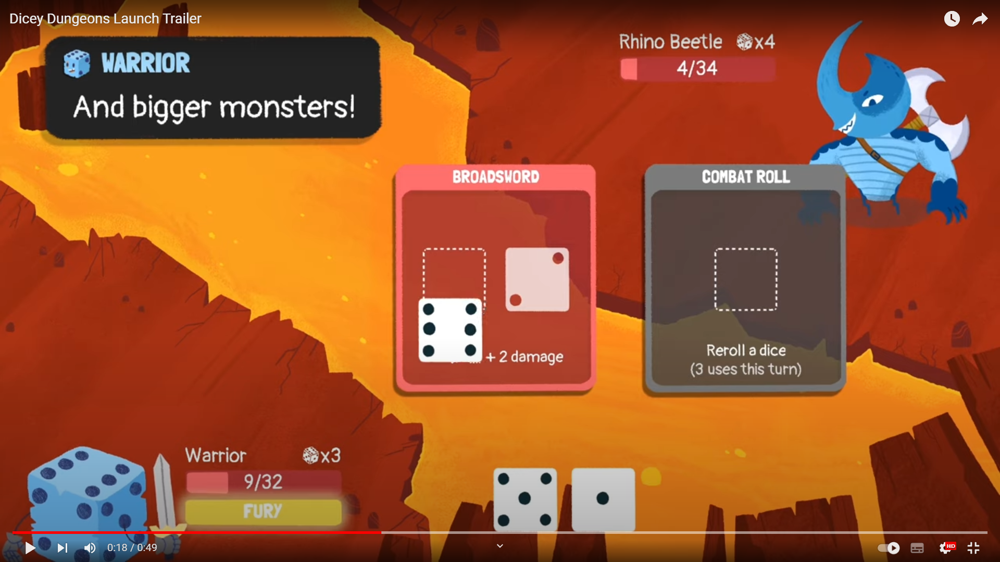
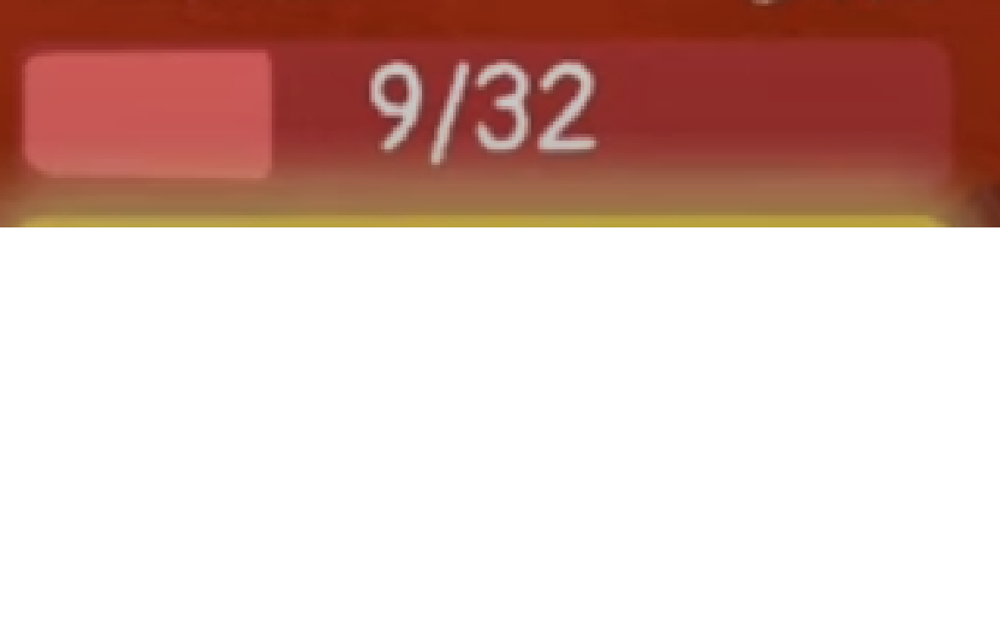
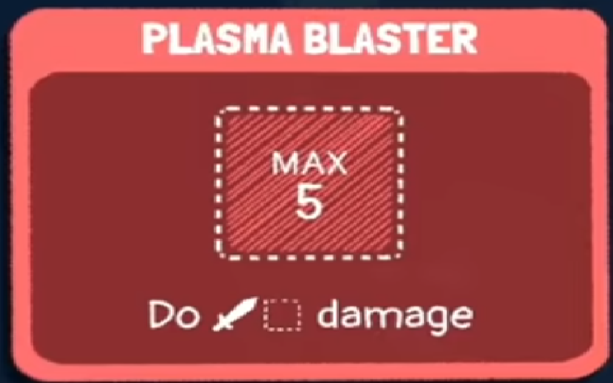
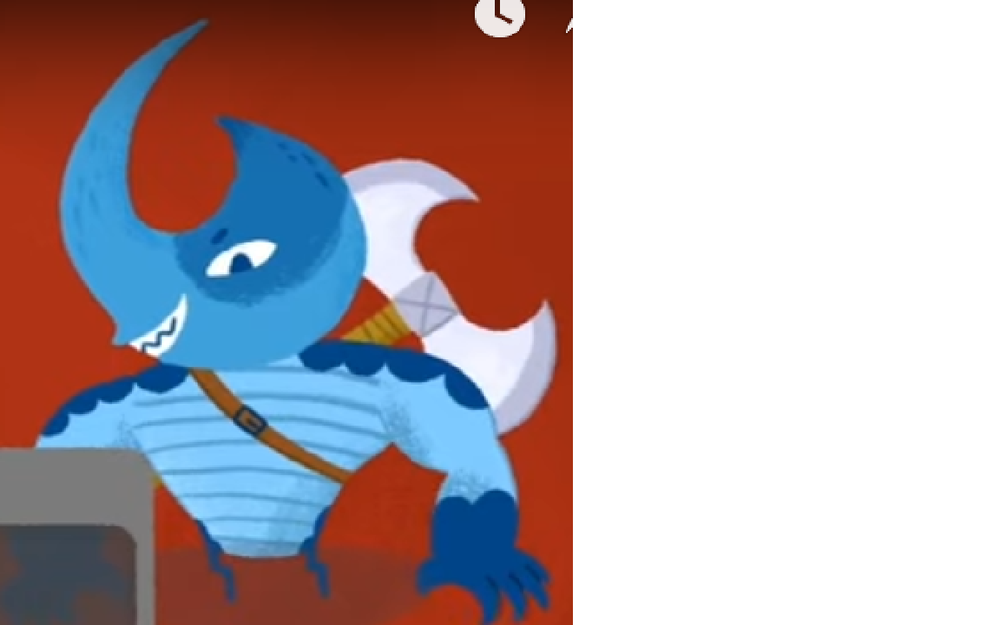
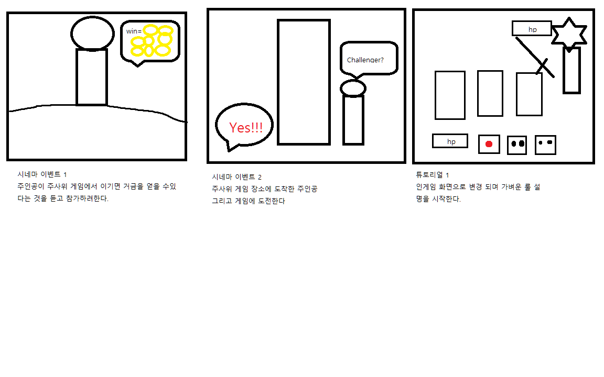

# 프로젝트명: rolling dice(이창준)

><목차>

1. [게임명:rolling dice]
2. [컨셉](#컨셉)
3. [관련이미지 & 동영상](#관련-이미지--동영상)
4. [대표이미지](#대표-이미지)
5. [컨셉 & 대표이미지 기반 작품묘사](#컨셉--대표이미지-기반-작품묘사)
6. [rolling dice 구성요소](#구성-요소)
7. [게임 시스템 디자인](#게임-시스템-디자인)
8. [개발 요구사항 & 흐름도](#개발-요구사항--흐름도)
9. [스토리보드](#스토리보드)
10. [프로토타입 개발 요구사항](#프로토타입-개발-요구사항)
11. [프로토타입 개발 작업일정](#프로토타입-개발-작업일정)

# [컨셉]

## 메인컨셉 : 회귀

- 죽을때마다 시작지점으로 돌아와 다시 도전해야 한다.

### 서브 컨셉 1 : 주사위

- 주사위를 던져 나온 숫자를 기반으로 싸우는 게임
- 
### 서브 컨셉 2 : 조합

- 여러 카드를 조합해 효율적인 플레이를 해야 한다

### 서브 컨셉 3 : 패턴 공개

- 적을 행동 패턴을 공개해 전략적인 플레이를 해야 한다. 

### 서브 컨셉 4 : 랜덤

- 무기도 적도 랜덤인 운 기반 게임

### 서브 컨셉 5 : 탐색

-  맵을 탐색해 위로 올라가는 시스템

  

# [관련 이미지 & 동영상]

- 이미지
  
- 동영상
  (https://www.youtube.com/watch?v=9K3SDa4HK4k)

  

# [대표 이미지]

  

# [컨셉 & 대표이미지 기반 작품묘사]

> ### 대표이미지 기반 : 주사위와 카드를 조합해 적을 쓰러트리며 계속 위로 올라가는 게임

> ### 컨셉 기반: 여러 종류의 주사위와 카드를 조합해 싸운다.

  

# [구성 요소]

- 

 

## 1. 메커니즘

[도전 과제]

1. 적을 쓰러트리며 던전을 탐험해 끝에 도전하는 게임

[재미 요소]

1. 랜덤한 무기와 주사위를 조합해 전략을 짜는 게임

 

## 2. 이야기

[만들게 된 배경]
과게에 게임을 해봤을때 여러 수정하고 싶은 것들이 있었는데 이 게임을 내가 리메이크 해보면 어떨까 싶어서 해보게 되었습니다. 

[카메라 관점]
2d 게임으로 적을 위에 배치하고 무기와 주사위를 아래에 배치한다.

 

## 3. 미적요소

[디자인][컬러]  
 전반적으로 밝은 분위기로 제작한다.
 분위기에 중요한 부분이므로 화려하게 할 예정입니다.

[음향]  
전체적으로 밝은 음악을 유지하고 보스 전에서는 어느 정도 진지한 음악을 사용 할 예정입니다.
 

## 4. 기술

unity 기반으로 pc플랫폼으로 개발할 예정입니다.

# [게임 시스템 디자인]

1.게임 오브젝트 분해

  |속성|영문명칭|설명|예시사진|
  |:----:|:-----:|:-------:|:----:|
  |체력|hp|플레이어 또는 적의 체력바||
  |카드|card|플레이어가 사용할 수 있는 무기||
  |주사위|dice|카드에 넣어 사용할 수 있는 주사위 1~6이 아닌 다른 숫자도 있을 수 있다.||
  |적|enemy|플레이어가 싸워야하는 적||
  
2.파라미터(속성)
  
  1.이름:card
  
  |속성|영문명칭|설명|
  |:----:|:-----:|:---------------------------:|
  |사용조건|use|이 카드를 사용하기위한 필요 주사위|
  |효과|effect|이 카드를 사용하면 발동되는 효과|
  
  2.이름:dice
  
  |속성|영문명칭|설명|
  |:----:|:-----:|:-----------------:|
  |숫자|number|6면에 각각 적혀있는 숫자|
  
  
3.행동

  1.오브젝트이름:player
  
  |행동|영문명칭|설명|
  |:----:|:-----:|:---:|
  |이동|move|탐색 파트일때 맵에서 다른 방으로 이동할 수 있다.|
  |카드사용|active card|전투 파트 일때 카드를 사용할 수 있다.|
  
  1.오브젝트이름:enemy
  
  |행동|영문명칭|설명|
  |:----:|:-----:|:----:|
  |패턴|active|플레이어 턴 종료시 예정된 행동을 시행한다.|
  
4.상태
  1.오브젝트이름 : player
  
  |현상태|전이상태|전이조건|
  |:----:|:-----:|:---------:|
  |평상시|사망|hp가 0 이되었을때|
  
  
  2.오브젝트이름 : enemy
  
  |현상태|전이상태|전이조건|
  |:----:|:-----:|:---------:|
  |평상시|사망|hp가 0 이되었을때|
  
5.플레이어 캐릭터 속성(파라미터)

  |속성|영문명칭|설명|
  |:----:|:-----:|:---------------------------:|
  |현재체력|CurHp|플레이어의 남은 생명력|
  |최대체력|MaxHp|플레이어의 남은 생명력|
  |소유카드|HaveCard|현재 소유한 카드|
  |장비카드|EquipCard|현재 장비한 카드|
  |소유주사위|HaveDice|현재 소유한 주사위|
  |장비주사위|EquipDive|현재 장비한 주사위|
  
6.게임의 규칙
  맵을 이동하면 적이 등장해 적을 쓰러뜨려야 앞으로 진행할 수 있다.
  hp가 0이 되면 게임에서 패배한다.
7.게임에서 사용될 공식
  -피해를 입으면 그 수치 만큼 hp가 줄어든다.

# [개발 요구사항 & 흐름도]
  1.요구사항
  
    시작화면,맵화면,전투화면 총 3개의 화면이 있다.
    
    시작화면에는 도전하기로 1개의 버튼이 있다.
    
    도전하기 버튼을 누르면 맵화면으로 이동한다.
    
    기본 주사위 제작
     
    맵 화면에서는 카드 변경 버튼과 다음 방 이동,현재 진행도가 뜬다.
    
    주사위 변경 버튼을 누르면 주사위변경 창이 뜨며 장비한 주사위를 교체할 수 있다.
    
    카드 변경 버튼을 누르면 카드변경 창이 뜨며 장비한 카드를 교체할 수 있다.
    
    기본 적, 카드 제작
    
    다음 방 이동 버튼을 누르면 적이 등장하며 전투화면으로 변경된다.
    
    전투화면에는 장비한 주사위,장비한 카드, 적,적의 행동,현재 턴, 턴종료 버튼이 뜬다
    
    턴 개시시 자동으로 주사위가 굴려져 주사위 숫자가 정해진다.
    
    카드에 주사위를 넣어 사용한다.
    
    적을 hp가 0이 되면 전투가 종료되며 보상을 받고 맵화면으로 변경된다.

    턴종료 버튼을 누르면 적의 행동을 시전하며 그 후 새로운 턴을 개시한다.
    
    플레이어의 hp가 0이 되면 게임이 종료되며 게임오버를 띄우고 시작화면으로 변경된다.
    
    진행도가 최대가 되면 보스가 등장한다.
    
    스토리 이벤트 제작
    
    튜토리얼 제작
    
    추가 카드 적 보스 주사위 제작
    
  2.키보드 이벤트에 대한 흐름도
  
  
  
  3.용어정리
  
# [스토리보드]
  
  
# [프로토타입 개발 요구사항]

# [프로토타입 개발 작업일정]

1주차 :기본 ui 구현
    
    시작화면,맵화면,전투화면 총 3개의 화면이 있다.(10%)
    
    시작화면에는 도전하기로 1개의 버튼이 있다.(10%)
    
    도전하기 버튼을 누르면 맵화면으로 이동한다.(10%)
    
2주차 :주사위 관련 시스템 제작
    
    임시 주사위 제작
     
    맵 화면에서는 카드 변경 버튼과 다음 방 이동,현재 진행도가 뜬다.
    
    주사위 변경 버튼을 누르면 주사위변경 창이 뜨며 장비한 주사위를 교체할 수 있다.
    
    카드 변경 버튼을 누르면 카드변경 창이 뜨며 장비한 카드를 교체할 수 있다.
    
3주차 :전투 관련 시스템 제작
    
    임시 적, 카드 제작
    
    다음 방 이동 버튼을 누르면 적이 등장하며 전투화면으로 변경된다.
    
    전투화면에는 장비한 주사위,장비한 카드, 적,적의 행동,현재 턴, 턴종료 버튼이 뜬다
    
    턴 개시시 자동으로 주사위가 굴려져 주사위 숫자가 정해진다.
    
    카드에 주사위를 넣어 사용한다.
    
    적을 hp가 0이 되면 전투가 종료되며 보상을 받고 맵화면으로 변경된다.
    
4주차 :전투 관련 시스템 제작2
    
    턴종료 버튼을 누르면 적의 행동을 시전하며 그 후 새로운 턴을 개시한다.
    
    플레이어의 hp가 0이 되면 게임이 종료되며 게임오버를 띄우고 시작화면으로 변경된다.
    
    진행도가 최대가 되면 보스가 등장한다.
    
5주차 : 스토리&편의성 관련 제작
    
    스토리 이벤트 제작
    
    튜토리얼 제작
    
6주차 : 추가 요소 제작

    추가 카드 적 보스 주사위 제작
